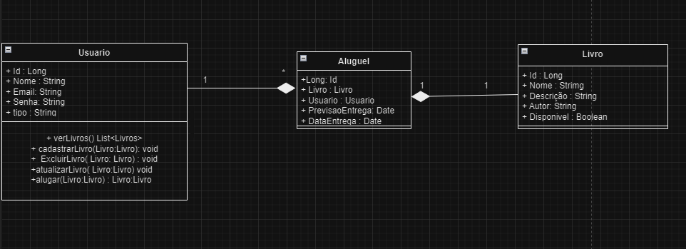

# Arquitetura da Solução

Pré-requisitos: <a href="3-Projeto de Interface.md"> Projeto de Interface</a>

Definição de como o software é estruturado em termos dos componentes que fazem parte da solução e do ambiente de hospedagem da aplicação.

## Diagrama de Classes

## Modelo Físico

{
  "Usuario":  
  
    {"id": "Long",
    "nome": "String",
    "email": "String"
    "senha": "String.
    "tipo": "String"}, 
  "Aluguel": 

    {"id": "Long", 
    "livro": "Livro",
    "usuario": "Usuario",
    "previsaoEntrega": "Date",
    "dataEntrega": "Date"},
  "Livro": 
  
    {"id": "Long",
    "nome": "String",
    "descricao": "String",
    "autor": "String",
    "disponivel": "Boolean"}
  }
}

## Tecnologias Utilizadas

Para a elaboração do software de Locação de livros da Igreja Batista Anunciar, ultilizaremos as seguintes tecnologias:
 - React Native - Front-end.
 - Java Script - Back-end.
 - Express 
 - Ioredis
 - Banco de dados Redis

## Hospedagem

A hospedagem e o lançamento do sistema serão publicados na plataforma Heroku.

## Qualidade de Software

As caractetisticas escolhidas foram : Funcionalidade(Adequação, Exatidão), Usabilidade (Inteligibilidade, Aprendizado), Desempenho (Tempo de Resposta, Eficiência), Manutenibilidade (Analisabilidade) e Segurança ( Integridade) abordam aspectos fundamentais que garantem a qualidade do sistema. As métricas permitirão à equipe monitorar a qualidade do software, facilitando ajustes e melhorias ao longo do desenvolvimento.
Essas características e subcaracterísticas foram escolhidas pois são essenciais para garantir que o sistema atenda às expectativas dos usuários e stakeholders. Elas asseguram que o software seja funcional, fácil de usar, eficiente, manutenível e seguro, promovendo uma boa experiência ao usuário.
